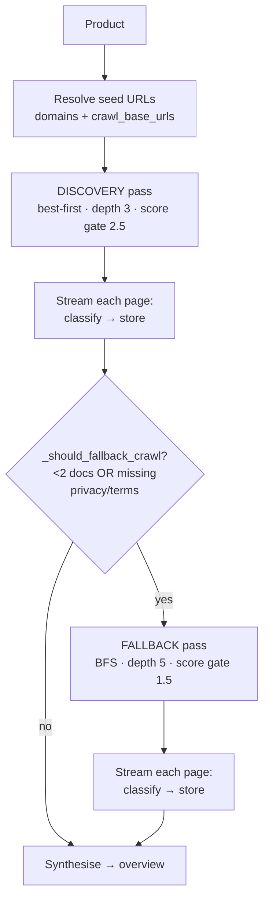
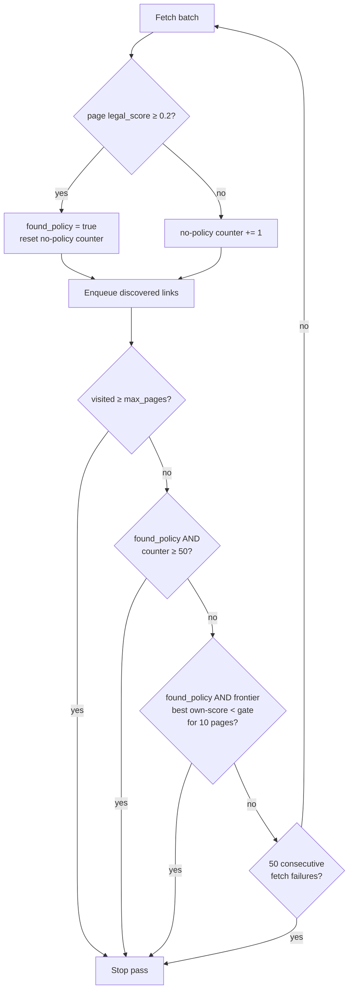
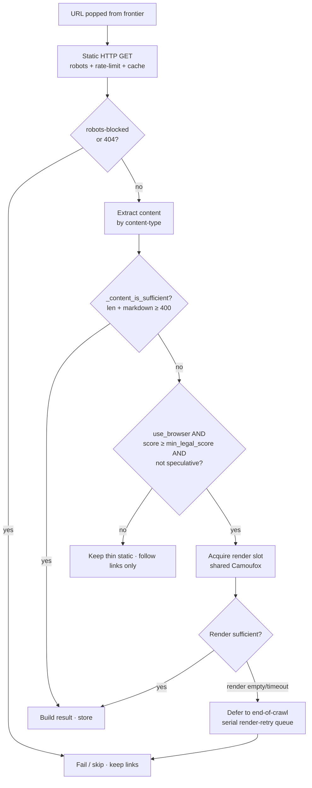

# Clausea Crawler

How the policy crawler discovers and extracts legal documents (privacy policies, terms of service, cookie policies, DPAs, sub-processor lists, and policy-adjacent pages like `/trust`, `/transparency`, children-safety notices) from a company's site.

Source: `src/crawler.py` (engine) and `src/pipeline.py` (orchestration). Tunables: `src/core/config.py` (`CrawlerConfig`).

## TL;DR

For each product we crawl its site looking for legal documents. A **best-first** pass visits the most policy-looking links first (cheap, precise). If that pass doesn't clearly find the privacy policy and terms, a **BFS fallback** pass sweeps everything (exhaustive, slower). Each page is fetched over plain HTTP first; if the body is too thin (a JS app shell), we re-fetch it in a headless browser. A crawl stops not at a page count but when it has found policy content and then gone ~50 pages with nothing new ("convergence"). Everything is tuned to **never miss a policy page**, accepting slower crawls as the cost.

### Glossary

| Term | Meaning |
|------|---------|
| **Seed URL** | A starting URL for a crawl: the product's domain root and any explicit `crawl_base_urls` overrides. |
| **Frontier** | The queue of URLs still to crawl. In best-first it's a priority heap ordered by policy-relevance; in BFS it's a FIFO. |
| **URL score** | 0–10 relevance of a URL guessed from its path/anchor text *before* fetching (`URLScorer`). Orders the frontier and gates browser rendering. |
| **Legal score** | 0–10 relevance of a *fetched page's body* (`ContentAnalyzer`). Drives convergence and what we keep. |
| **Score gate** (`min_legal_score`) | Minimum score for a page to be browser-rendered/kept. 2.5 in discovery, 1.5 in fallback. |
| **Convergence** | Stopping a crawl after N consecutive policy-empty pages (default 50), once at least one policy page was found. |
| **Render slot** | A concurrency permit for the shared headless browser; limits simultaneous renders so they don't starve each other. |
| **Trusted seed** | A `crawl_base_urls` override that bypasses the URL-score gate (a known policy page whose path lacks policy keywords). |

---

## 1. Design priority: recall over speed

The crawler exists to **never miss a policy page**. Every design trade-off resolves in favour of coverage:

- We crawl broadly and stop late rather than early.
- We escalate to a full headless-browser render for any page that *might* be a policy doc but came back thin.
- We defer failed renders for a serial retry at the end of a crawl instead of dropping the page.
- A second, exhaustive crawl pass runs whenever the first pass didn't clearly cover the required documents.

Speed and efficiency matter only after recall is satisfied. The cost of this is longer crawls on dead/blocked sites — accepted deliberately.

---

## 2. Where the crawler sits

```
LegalDocumentPipeline  (src/pipeline.py)
   │   per product:
   │   1. resolve seed URLs (domains + crawl_base_urls overrides)
   │   2. DISCOVERY pass  → best-first crawl, precision-first
   │   3. (conditional) FALLBACK pass → BFS crawl, recall-first
   │   each crawled page is streamed straight into:
   │        classify → store  (no end-of-crawl batch)
   ▼
ClauseaCrawler  (src/crawler.py)
   ├─ URLScorer            score a URL's policy-relevance from its path/anchor
   ├─ ContentAnalyzer      score a fetched page's body for legal content
   ├─ static fetch (aiohttp) → quality gate → browser render (Camoufox) fallback
   ├─ RobotsTxtChecker     robots.txt compliance (per-domain, cached)
   ├─ DomainRateLimiter    per-domain politeness delay + jitter
   ├─ HTTPCache            ETag / Last-Modified conditional requests
   ├─ sitemap discovery    seed depth-0 URLs from robots.txt + /sitemap.xml
   └─ the frontier         best-first priority queue OR BFS queue
```

The pipeline streams each result through classification and storage *as pages arrive* (`result_callback` in `_process_product`). A crawl killed by a time ceiling or stall keeps everything stored so far; it never loses an end-of-crawl batch.

### Per-product flow



---

## 3. The two crawl passes

Each product is crawled by up to two passes, both starting from the same seed URLs.

### Pass 1 — Discovery (precision-first)
- Strategy: **best-first** (`CRAWLER_DISCOVERY_STRATEGY=best_first`)
- Depth cap: 3 (`_DISCOVERY_DEPTH_CAP`)
- Page cap: `min(max_pages, 1000)` → effectively `max_pages` (400)
- Min legal score to render/keep: `2.5` (`CRAWLER_DISCOVERY_MIN_LEGAL_SCORE`)

Best-first follows the most policy-relevant links first, so on a normal site it finds `/privacy`, `/terms`, etc. quickly and cheaply.

### Pass 2 — Fallback (recall-first), conditional
Runs only when `_should_fallback_crawl(documents_found_so_far)` is true (`src/pipeline.py:1367`):

```python
def _should_fallback_crawl(self, documents):
    if len(documents) < self.min_docs_before_fallback:   # default 2
        return True
    doc_types = {doc.doc_type for doc in documents}
    return not all(req in doc_types for req in self.required_doc_types)
    #            required = {privacy_policy, terms_of_service}
```

So the fallback fires if pass 1 found **fewer than 2 policy docs** *or* is **missing privacy_policy or terms_of_service**. If pass 1 already cleared the bar, the fallback is **skipped entirely** — easy sites get one pass.

- Strategy: **BFS** (`CRAWLER_FALLBACK_STRATEGY=bfs`)
- Depth cap: 5 (`CRAWLER_MAX_DEPTH`)
- Page cap: 400 (`CRAWLER_MAX_PAGES`)
- Min legal score: `1.5` (`CRAWLER_FALLBACK_MIN_LEGAL_SCORE`) — lower, casts a wider net

BFS follows *every* same-domain link with no score ordering. It's the exhaustive backstop that defeats the "policy page buried behind low-scoring pages" failure mode best-first can hit. The fallback is a fresh crawler instance, so its stopping counters start clean.

**Why two strategies, not one:** best-first is precise but can deprioritise a real policy page reachable only through dull intermediate pages; BFS is exhaustive but slow and wandering. Running the cheap precise pass first and the exhaustive pass only when needed is the recall-vs-cost balance.

### Multiple seeds share one page budget

A product can have several seed URLs (its domain root plus every `crawl_base_urls` override — Shein has ten distinct policy pages). Within a pass, `crawl_multiple` (`src/crawler.py:4390`) crawls each seed in turn, **fully resetting per-crawl state between seeds**.

The seed *count* must not multiply the work: ten seeds each given a full `max_pages` budget would be ten back-to-back 400-page crawls per pass, enough to blow the pipeline's 20-minute stall guard and get the job reset and recrawled forever. So the budget is **divided across the seeds**:

```
per_seed_max_pages = max(MIN_PAGES_PER_SEED, max_pages // seed_count)
```

`MIN_PAGES_PER_SEED` (60, env `CRAWLER_MIN_PAGES_PER_SEED`) is a floor so each seed still gets enough breadth for convergence (50) and relevance-exhaustion to fire naturally before the cap bites. A single-seed product is unaffected (`max(60, 400) = 400`). Each seed's own page is always fetched first (it's enqueued at depth 0), so dividing the *discovery breadth* never drops a known policy page. The full budget is restored after the batch so the next product isn't shrunk.

---

## 4. The crawl loop and the frontier

`ClauseaCrawler.crawl()` (`src/crawler.py:4143`) runs one pass:

1. **Seed.** Normalize the base URL, push it to the frontier with a generous score (seeds always crawl regardless of score).
2. **Sitemap seeding.** Discover sitemaps (§7) and push policy-relevant sitemap URLs as depth-0 seeds. URLs scoring below `min_legal_score` are skipped so a giant product/catalog sitemap can't flood the queue.
3. **Main loop** (`while len(visited) < max_pages`): pop a batch (up to `max_concurrent`), fetch them concurrently, and for each result:
   - update convergence counters,
   - enqueue its discovered links (even from *failed* pages — a thin shell still footers to the real policy pages),
   - stream the result to the pipeline,
   - check the stopping conditions (§5).
4. **Render-retry drain.** After the loop, serially retry any policy-relevant pages whose browser render failed under load (recall over speed). Each retry reports progress regardless of outcome (`_drain_render_retries`), so a long drain of failing renders can't go silent and trip the pipeline stall guard — see the callout in §8.

### Frontier ordering
- **best-first** (`_enqueue_best_first`, `src/crawler.py:3861`) uses a heap keyed by the tuple `(policy_rank, -score, url, depth, base_score)`:
  - `policy_rank = 0` if the URL path unambiguously names a policy doc (`is_strong_policy_path`), else `1`. **Rank-0 URLs are always popped before any other URL, whatever their score** — so a `/privacy` link, once discovered, jumps ahead of an entire marketing section.
  - Within a rank, higher `score` wins.
  - `base_score` is the URL's *own* score excluding any parent-page boost; used to detect relevance exhaustion (§5).
- **BFS** uses a plain FIFO `deque`; **DFS** (unused in prod) uses a stack.

---

## 5. Stopping conditions

A pass ends when **any** of these fires (checked every batch):

| # | Condition | Where | Meaning |
|---|-----------|-------|---------|
| 1 | `len(visited) >= max_pages` | loop guard | Hard page ceiling (400). A backstop; rarely reached. |
| 2 | Frontier empty | `if not batch: break` | Nothing left to crawl within depth. |
| 3 | **Convergence** | `_has_converged` (4130) | Policy already found **and** `no_policy_page_budget` (50) consecutive pages since one scored at/above `CONVERGENCE_LEGAL_SCORE` (0.2). |
| 4 | **Relevance exhausted** | `_relevance_exhausted` (3875) | best-first only: policy found **and** frontier's best *own*-score < `min_legal_score` for `CRAWL_EXHAUSTION_GRACE` (10) pages. The good leads are drained. |
| 5 | **Bot-wall abort** | counter (4349) | `CRAWL_BOT_WALL_ABORT` (50) consecutive fetch *failures*; any success resets it. The site is actively blocking us. |
| 6 | Stop-early | `_should_stop_early` | Caller's coverage criteria already satisfied. |

### Per-batch decision (best-first pass)



### What actually stops most crawls
**Not** the 400 cap. In practice condition #3 (convergence) or #4 (relevance exhaustion) fires first, stopping discovery at ~60–70 pages. Real log line:

```
🧭 Crawl converged: 54 consecutive pages with no policy content (budget 50); stopping discovery at 62 pages.
```

### Important subtleties of convergence (#3)
- It only fires **after at least one policy page has been found** (`found_policy` must be true). The crawler never gives up on a site where it has found nothing.
- The counter resets to 0 whenever a page scores `>= 0.2` (`CONVERGENCE_LEGAL_SCORE`) — a *very* low bar. So "50 in a row" means 50 pages that were essentially policy-empty, not 50 since the last real doc. Cookie notices, `/trust`, consent pages all reset it.
- `no_policy_page_budget <= 0` disables convergence entirely (crawl runs to `max_pages` or frontier exhaustion).

### The 50 / 400 / 800 numbers, plainly
- **50** = consecutive policy-empty pages before convergence gives up. This is the real terminator (~65 pages typical).
- **400** = hard page cap per pass. A backstop; only matters for a giant site that keeps finding *new* policy content and never goes 50-empty.
- **~800** = two passes × 400. The theoretical max across discovery + fallback. Never reached in practice.

The single dial for "miss nothing vs. speed" is `CRAWLER_NO_POLICY_PAGE_BUDGET` (the 50), **not** the 400.

---

## 6. URL scoring (`URLScorer`)

`score_url(url, anchor_text)` (`src/crawler.py:744`) returns a 0–10 relevance score from the URL path, query, and (when following a link) the anchor text. Used to order the best-first frontier and to gate browser rendering.

Signals, additive:

- **High-value path/anchor phrases** (`compiled_high_value_patterns`): `privacy-policy` 8.0, `terms-of-service` 8.0, `terms of use` 7.5, `data-processing-addendum` 8.0, `cookie-policy` 7.0, `gdpr`/`ccpa` 6.0, `subprocessors` 6.0, …
- **Path patterns** (`compiled_path_patterns`): `/privacy` 5.0, `/terms` 4.5, `/legal` 4.0, `/dpa` 5.0, `/transparency` 3.5, `/security` 3.0, and many nested combos (`/company/privacy`, `/legal/policies/terms`, …).
- **Anchor text** is weighted heavily — a phrase match scores `weight × 2.5`, a keyword `weight × 2.0`. Anchor text is often the only signal for opaque URLs like `/help/article/2908` labelled "Terms of Service".
- **Keyword matches** in path words (`legal_keywords`: privacy 5.0, terms 4.0, policy 4.0, …), with substring matches at 0.8×.

Hard rules (override the additive score):
- **Auth/account flows** (`/login`, `/signup`, `/oauth`, …) → score `0.0`.
- **User-generated galleries** (`/templates`, `/marketplace`, `/gallery`, …) → score `0.0`, *hard* exclusion that anchor/parent boosts cannot revive. These carry legal keywords in object slugs but never host the company's own policies.
- **Glossary "terms"** (e.g. `/chess/terms/absolute-pin`) → demoted by 8.5 so it doesn't score like a real `/terms` page.
- `is_strong_policy_path` (`src/crawler.py:859`) matches a path segment that unambiguously names a policy doc (`privacy|terms|tos|legal|cookies|gdpr|ccpa|dpa|policies|policy|eula|acceptable-use|community-guidelines`). Drives the rank-0 priority in the frontier.

A **parent-page boost** (`_compute_parent_page_boost`) raises the score of links discovered on a "policy hub" page, so links off a `/legal` index inherit relevance even when their own paths are opaque. The boost is tracked separately (`base_score`) so relevance-exhaustion only counts a URL's *own* signal.

---

## 7. Sitemap discovery

`_discover_sitemap_urls` (`src/crawler.py:2883`) seeds the crawl from sitemaps before link-following begins:

1. Read `Sitemap:` directives from `robots.txt`, then well-known paths (`/sitemap.xml`, …).
2. Fetch each, following sitemap-index files **one level deep**.
3. Bound the work so a huge site can't hang discovery:
   - Skip sitemaps larger than **5 MB** (declared or actual).
   - Child sitemaps are partitioned: **policy-named** (URL matches `_POLICY_SITEMAP_RE`: legal/privacy/terms/cookie/gdpr/…) are always fetched up to `CRAWLER_MAX_CHILD_SITEMAPS` (200); **generic** ones (content/product/numbered) are capped tightly at `_MAX_GENERIC_CHILD_SITEMAPS` (8) as a safety net for opaque names.
   - Skipped generic counts are logged.

Sitemap URLs are seeded only if they pass `should_crawl_url` *and* score ≥ `min_legal_score`. Policy pages live in small sitemaps and are also reachable via the link crawl, so skipping oversized/excess content sitemaps is recall-safe. If no sitemap URL qualifies, speculative path probing (`generate_potential_policy_urls`) kicks in.

---

## 8. Fetch → quality gate → browser render

`_fetch_page_internal` (`src/crawler.py:3427`) is a three-stage pipeline per URL:

1. **Static HTTP fetch** (`_static_fetch`): rate-limited, robots-checked, conditional-cached `aiohttp` GET. Follows redirects (the *resolved* URL is used downstream). Bodies capped at 5 MB. 404s and not-found landing pages short-circuit (no render).
2. **Content extraction** (`_extract_page_content`): routed by content-type → HTML / Markdown / plain-text / XML / binary (PDF). HTML extraction isolates the main policy body and strips consent widgets (`_extract_main_content_soup`, `_is_consent_container`) so we capture the real policy text, not the cookie banner.
3. **Quality gate** (`_content_is_sufficient`, `src/crawler.py:1942`): the static result is "unusable" if it's garbled, has JS-required markers, is shorter than the length floor (`1000` chars for high-score URLs, else `500`), or its extracted markdown body is `< 400` chars (an SPA shell whose visible text is nav/JSON).

If the static result is unusable **and** `use_browser` is on **and** the URL isn't a speculative guess **and** its relevance score ≥ `min_legal_score`:

- Acquire a **render slot** (a process-global semaphore sized by `CRAWLER_BROWSER_CONCURRENCY`, default 4) and render with a **shared Camoufox instance** (§9).
- If the render yields sufficient content → use it.
- If the render returns nothing (almost always a navigation/starvation timeout, not a truly empty page) → **defer** the URL to the end-of-crawl serial retry queue rather than drop it.

Low-relevance unusable pages are kept as-is (cheap) so their links can still be followed, but are **not** rendered — rendering a JS marketing page burns a full timeout for a page we don't want.

### Per-URL fetch decision flow



> **Known failure mode (e.g. OpenAI):** a site behind a Cloudflare "Enable JavaScript and cookies" challenge returns a 403 shell to the static fetch (→ insufficient) and then hangs the browser `goto` to the 20 s timeout (→ render empty). Every policy page fails and the product ends with 0 docs (`no_documents`). The bot-wall abort is slow to trip because the site's *marketing* pages load fine and keep resetting the consecutive-failure counter.
>
> Two safeguards keep this from poisoning the queue: the render-retry drain reports a heartbeat per retry (§4) so a wall of 20 s render timeouts no longer reads as a stall, and the per-seed budget split (§3) bounds how much of this a many-seed product can rack up. The actual *fix* — so these pages render instead of failing — is a clean egress IP: the renders succeed in ~1.5 s from a residential IP and only time out from the datacenter IP, so route renders through a residential proxy via `CRAWLER_PROXY`.

---

## 9. Browser rendering (Camoufox)

- **One shared browser instance per worker** (`_get_shared_browser_lock`, `_setup_browser`). Pages are created per render; the browser is not relaunched per URL.
- **Render concurrency** is bounded by a process-global semaphore (`_get_global_browser_slot`, sized once per event loop from `CRAWLER_BROWSER_CONCURRENCY`). Too many simultaneous JS-heavy navigations starve each other into timeouts, so this is the real throttle on render throughput — distinct from `CRAWLER_CONCURRENT_LIMIT` (static-fetch concurrency).
- Heavy assets (images, fonts, media, analytics) are aborted at the network layer (`_block_heavy_assets`) to speed renders.
- Navigation timeout `BROWSER_NAV_TIMEOUT_MS` (20 s); up to `SPA_HYDRATION_RETRIES` (3) short polls if initial DOM text is thin.
- Render instrumentation (attempts / failures / recovered-on-retry / slot-wait time) is logged at the end of each pass for tuning.

---

## 10. Deduplication

Three layers prevent re-crawling and storing the same content:

1. **URL normalization** (`normalize_url`): lowercases host, strips tracking/redirect query params, normalizes trailing slashes. Visited/failed/queued sets are keyed on the normalized form.
2. **Locale dedup** (`should_crawl_url`, helpers at top of file):
   - **English region variants** (`/en-us`, `/en-gb`, …) of the same canonical doc are capped at `MAX_ENGLISH_LOCALE_VARIANTS_PER_DOC` so en-* mirrors don't explode the crawl.
   - **Non-English translations** collapse to one representative per canonical key.
   - **Jurisdictional regions** (`/eu` vs `/us`) keep *separate* keys — these are genuinely different policies and are all preserved.
3. **Content fingerprint** (`seen_fingerprints` in the pipeline): near-duplicate page bodies are skipped across passes even when URLs differ.

Mirror/non-production subdomains (`internal`, `staging`, `preview`) are rejected outright. Only HTTPS is crawled.

---

## 11. Trusted seeds (`crawl_base_urls`)

A product's `crawl_base_urls` are explicit policy-page overrides (from the user or browser extension). They:

- are always crawled regardless of their URL score, and
- **bypass the URL-score gate** in `_process_crawl_result` — their path may carry no policy keywords (e.g. Amazon's `/gp/help/customer/display.html`) yet still be a real policy doc.

They do **not** restrict crawl breadth: non-seed URLs discovered during the crawl are still scored, fetched, and stored normally. The content-based LLM classifier runs on every page regardless of how it was reached. Domain roots (from `product.domains`) go through normal scoring.

---

## 12. Politeness, robustness, resume

- **Rate limiting** (`DomainRateLimiter`): per-domain delay `CRAWLER_DELAY_BETWEEN_REQUESTS` (1.0 s) + jitter (0.2), so concurrent requests to *different* domains aren't throttled against each other.
- **robots.txt** (`RobotsTxtChecker`): respected by default (`CRAWLER_RESPECT_ROBOTS_TXT`), cached per origin, with a per-domain ignore list. Blocks are surfaced to the pipeline (so the user learns the *site* blocked us, vs. a generic fetch failure).
- **Retries** (`fetch_page`): transient network errors and 429/5xx retry with exponential backoff (`max_retries`); 4xx return immediately.
- **HTTP cache** (`HTTPCache`): conditional `If-None-Match` / `If-Modified-Since`; a 304 reuses cached metadata.
- **Resume** (`recently_stored_urls`): a retried crawl skips re-fetching docs stored within `RESUME_FRESH_HOURS`, so it resumes instead of re-rendering hours of work. Docs older than the window are re-fetched, so scheduled monitoring re-crawls still detect policy changes.

---

## 13. Configuration reference (env vars)

All on `CrawlerConfig` (`src/core/config.py`) unless noted; all overridable in Railway without a code change (changing one triggers a redeploy → boot stale-sweep, which resets in-flight crawls).

| Env var | Default | Effect |
|---------|---------|--------|
| `CRAWLER_MAX_PAGES` | 400 | Hard page cap per pass. Backstop, rarely hit. |
| `CRAWLER_MAX_DEPTH` | 5 | Max link depth (fallback pass; discovery is capped at 3). |
| `CRAWLER_NO_POLICY_PAGE_BUDGET` | 50 | **The recall dial.** Consecutive policy-empty pages before convergence stops. Raise for more recall, slower crawls. |
| `CRAWLER_EXHAUSTION_GRACE` | 10 | best-first grace pages before relevance-exhaustion can fire. |
| `CRAWLER_BOT_WALL_ABORT` | 50 | Consecutive fetch failures before aborting a blocked site. |
| `CRAWLER_MIN_PAGES_PER_SEED` | 60 | Floor on the per-seed page budget when `max_pages` is divided across a product's seeds. |
| `CRAWLER_DISCOVERY_STRATEGY` | best_first | Pass-1 strategy. |
| `CRAWLER_FALLBACK_STRATEGY` | bfs | Pass-2 strategy. |
| `CRAWLER_DISCOVERY_MIN_LEGAL_SCORE` | 2.5 | Pass-1 score gate for render/keep. |
| `CRAWLER_FALLBACK_MIN_LEGAL_SCORE` | 1.5 | Pass-2 score gate (wider net). |
| `CRAWLER_MIN_DOCS_BEFORE_FALLBACK` | 2 | Below this many docs, fallback always runs. |
| `CRAWLER_REQUIRED_DOC_TYPES` | privacy_policy,terms_of_service | If any missing after pass 1, fallback runs. |
| `CRAWLER_CONCURRENT_LIMIT` | 20 | Concurrent static fetches. |
| `CRAWLER_BROWSER_CONCURRENCY` | 4 | Concurrent browser renders (real render throttle). |
| `CRAWLER_USE_BROWSER` | true | Enable Camoufox render fallback. |
| `CRAWLER_DELAY_BETWEEN_REQUESTS` | 1.0 | Per-domain politeness delay (s). |
| `CRAWLER_TIMEOUT` | 30 | Static fetch timeout (s). |
| `CRAWLER_RESPECT_ROBOTS_TXT` | true | Honour robots.txt. |
| `CRAWLER_MAX_CHILD_SITEMAPS` | 200 | Cap on child sitemaps followed (hard upper bound). |
| `CRAWLER_MAX_GENERIC_CHILD_SITEMAPS` | 8 | Cap on non-policy-named child sitemaps. |
| `CRAWLER_MAX_PARALLEL_PRODUCTS` | 3 | Products crawled concurrently per worker. |

Internal constants (not env-tunable): `CONVERGENCE_LEGAL_SCORE = 0.2`, `_DISCOVERY_DEPTH_CAP = 3`, `_DISCOVERY_PAGE_CAP = 1000`, `MIN_CONTENT_LENGTH_FOR_SPA_CHECK = 500`, `MAX_RESPONSE_BYTES = 5 MB`, `BROWSER_NAV_TIMEOUT_MS = 20000`.

---

## 14. Worked example (a normal site)

1. Seed `https://acme.com`. Sitemap discovery seeds `/privacy`, `/terms`, `/cookie-policy` (all rank-0, high score).
2. Best-first pops the three policy URLs first (rank-0 beats everything). Each static-fetches fine, scores well above 0.2 → `found_policy = true`, convergence counter stays at 0.
3. Their discovered links (`/legal/dpa`, `/trust`) get crawled next by score.
4. The frontier now holds only marketing links (own-score ~0). After 10 such pages with no new lead, **relevance-exhaustion** fires → pass 1 stops at ~25 pages with privacy + terms + cookies + dpa stored.
5. `_should_fallback_crawl`: ≥2 docs and both required types present → **fallback skipped**.
6. Pipeline classifies + stores as it went; synthesis and overview generation proceed.

A hard site (SPA, policies buried, or only a cookie notice found in pass 1) instead triggers the BFS fallback, which sweeps every same-domain link to depth 5 until it converges or exhausts the frontier.
