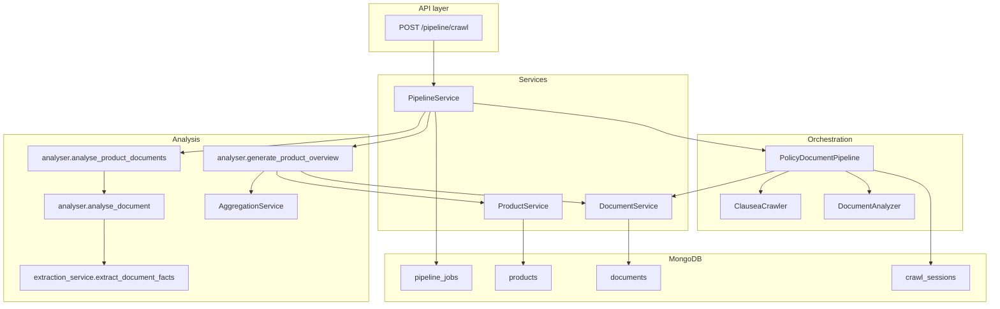
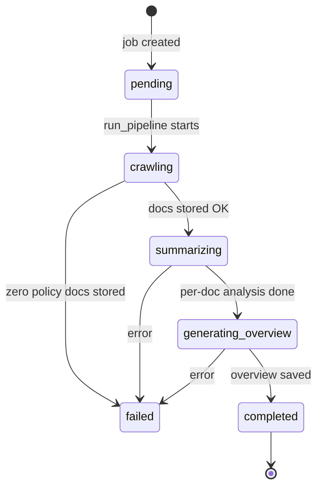
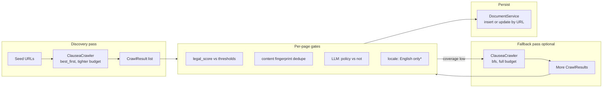
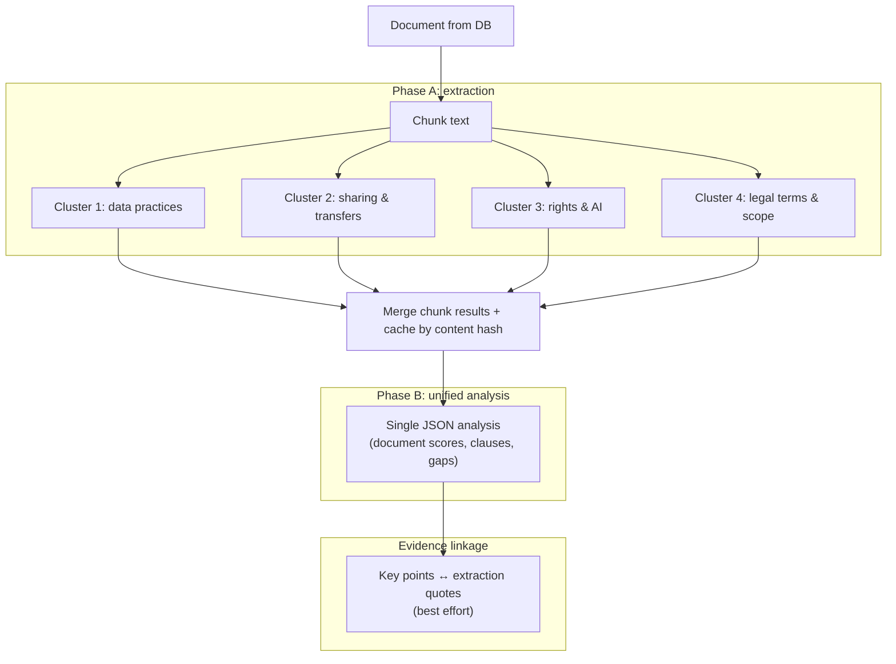
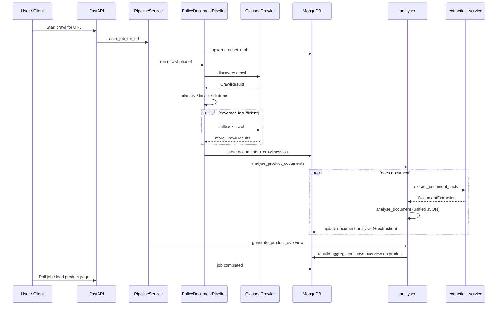

# From first URL to a finished product: how Clausea crawls, analyzes, and ships a policy intelligence pipeline

Clausea turns a company’s public web presence into structured, evidence-backed intelligence about privacy policies, terms, and related legal documents. This article walks through the full path—from HTTP crawl to stored documents, per-document AI analysis, and a product-level overview—focusing on **architecture**, **strategies**, **which models are involved**, and **what is deliberately different** about our approach.

---

## The story in one paragraph

A user submits a URL. The API creates or reuses a **product** (identified by domain) and a **pipeline job** tracked in MongoDB. The job runs three coarse steps: **crawling** (discover and persist policy pages), **summarizing** (deep analysis of each document), and **generating a privacy overview** (synthesis across core documents plus deterministic cross-document signals). Under the hood, crawling is a **two-pass** system (precision-first discovery, recall-oriented fallback), analysis is **evidence-first** (structured extraction before interpretation), and LLM calls go through **LiteLLM** with **model fallback**, **usage tracking**, and **circuit breaking** for resilience.

---

## System architecture: who calls whom

The dashboard and public app talk to FastAPI routes. User-triggered indexing flows through `PipelineService`, which owns job state and invokes the heavy lifters: `PolicyDocumentPipeline` for crawl + ingest, and `analyser` for post-crawl intelligence.

**Design choices that matter**

- **Service layer**: Business logic stays in services (`PipelineService`, `DocumentService`, `ProductService`); routes stay thin.
- **Async I/O**: Crawling, DB access, and LLM calls are async-friendly so we can overlap work without blocking the event loop.
- **Observable jobs**: Each pipeline job records step status, progress (pages scanned, documents analyzed), and crawl failures (for example robots.txt blocks) so the UI can show honest, actionable feedback.

---

## End-to-end pipeline job (product lifecycle)

When someone starts a crawl for a URL, we normalize the domain, resolve or create a **product**, and attach a **pipeline job** with three named steps: `crawling`, `summarizing`, `generating_overview`. The job is the contract between backend and frontend polling.

If the product already has a completed overview, we short-circuit and return **already indexed**—avoiding redundant cost and user wait time.

---

## Phase 1: Crawling—discovery, then optional deep fallback

`PolicyDocumentPipeline._process_product` is the heart of crawl orchestration. It does **not** mix “fetch everything” with “understand everything” in one opaque step. Instead:

1. **Discovery pass** — smaller depth/page budget (capped globally relative to the full budget), **best-first** ordering by default, and a **higher** minimum URL legal-relevance score so we spend crawl budget on pages that look like policies first.
2. **Classify and score** — each successful page runs through LLM-assisted classification, locale detection, region detection, effective-date extraction, and title extraction. Non-policy and non-English pages are dropped early.
3. **Fallback pass** (conditional) — if we did not find enough documents or we are missing **required document types** (by default privacy policy and terms of service), we run a second crawl with the **full** depth/page budget, **BFS** by default, and a **lower** legal-score threshold to improve recall.

\*Non-English support is a known gap today; the pipeline intentionally skips non-English content after detection to avoid misleading analyses.

### Crawler mechanics: static HTTP, browser rendering, and politeness

`ClauseaCrawler` combines:

- **Static fetching** via `aiohttp` for fast paths when HTML is already meaningful.
- **Optional browser rendering** (Playwright via Camoufox) when SPAs serve thin shells—short hydration polling if the initial DOM text is too small.
- **robots.txt respect** (configurable), **rate limits**, **jittered delays**, **concurrent caps**, and an explicit **User-Agent** identifying the bot.
- **Domain allowlists** from the product record, optional path allow/deny lists, and **no following external links** by default—reducing scope creep and respecting site boundaries.

### URL prioritization without an LLM: ContentAnalyzer

Before expensive per-page LLM work, the crawler scores URLs and pages with `ContentAnalyzer`: regex and keyword signals tuned for legal/policy language (privacy, terms, DPA/subprocessor language, retention, rights, and more). Scores feed **best-first** ordering and **min_legal_score** filtering so crawl queues stay focused. This is a deliberate **cost and latency** optimization: use cheap signals to steer, use LLMs to confirm.

### Deduplication and storage

- **Near-duplicate content** is skipped using a normalized text fingerprint (hash of whitespace-normalized, lowercased prefix of body text)—so the same policy at two URLs does not double-count.
- **Storage** compares content plus key metadata (title, type, locale, regions, effective date) to decide whether to update an existing document by URL or skip unchanged rows—keeping MongoDB aligned with the live web without churning writes.

### Audit trail

Each product crawl can open a **crawl session** in MongoDB with seed URLs, settings snapshot, and completion stats—useful for debugging “why did we miss X?” without guessing.

---

## Phase 2: Summarizing—evidence-first document analysis

After documents exist in MongoDB, `analyse_product_documents` loads all documents for the product and analyzes **up to three documents concurrently** (each document internally runs highly parallel LLM work, so this cap balances throughput against provider rate limits).

### Two-phase analysis per document

For each document, `analyse_document` follows a strict contract:

1. **`extract_document_facts`** — chunk the document (markdown-aware splitting, size/overlap tuned for context windows). For **each chunk**, run **four extraction clusters in parallel** (data practices, sharing and transfers, rights and AI, legal terms and scope). Each cluster returns **structured facts with quoted evidence** intended to anchor downstream prose in the actual policy text.
2. **Unified deep analysis** — one JSON-shaped LLM response builds summaries, scored dimensions, risk framing, critical clauses, key sections, and completeness flags—but the prompt **instructs the model to use only extracted facts** for claims, reducing graceful hallucination on dense legal text.
3. **Fallback path** — if extraction fails, we fall back to raw text (truncated for very large documents) with explicit “partial completeness” signaling.

**Why this is an innovation, not just “more prompting”**

- **Evidence-first**: Interpretation is constrained to extracted, quotable material—closer to how a careful reviewer works than to a single pass over raw HTML.
- **Parallel cluster design**: Latency scales roughly like **one** heavy extraction round per chunk, not four serial passes.
- **Chunk-aware splitting**: Respects markdown structure where possible so sections stay coherent inside windows.

### Caching and invalidation

Analysis can be reused when a **content hash** on the document matches—if the policy text changes, we re-run. Product overviews are invalidated when underlying documents change (handled in document update paths) so cached summaries do not lie.

---

## Phase 3: Product overview—core documents, aggregation, and conflicts

`generate_product_overview` produces the **cached overview** served on product pages. Important details:

- It **rebuilds findings and aggregation** for the product so cross-document structure is fresh.
- It **prefers core document types** (privacy, terms, cookies, etc.—see `OVERVIEW_CORE_DOC_TYPES` in prompts) and **excludes** peripheral policies that would dilute privacy signal (for example some editorial or IP-focused documents are analyzed per doc but not fed into the top-level overview unless nothing core exists).
- It passes **deterministic cross-document conflicts** from the aggregation engine into the LLM prompt so contradictions between documents are surfaced explicitly—not only inferred from prose.

This path is **not** the same as chat retrieval over embeddings: the overview is a **curated synthesis** from structured analyses and extractions, plus engine-detected conflicts.

---

## LLMs and models: how Clausea talks to AI

All chat-style completions route through **LiteLLM** behind `acompletion_with_fallback` in `src/llm.py`.

### Provider abstraction and fallback

- **Default priority** is configured as a short list (today defaulting to a fast OpenAI mini-class model). Each request tries models **in order** until one succeeds.
- **Per-model kwargs sanitization** removes incompatible parameters (for example temperature constraints on some models).
- **Automatic usage tracking** attaches token and cost estimates from responses for observability and accounting.
- **Circuit breaker**: repeated total failure across the priority list increments a counter; after a threshold, we fail fast with `CircuitBreakerError` to protect the system and downstream dependencies.

### Supported model families (as wired in code)

The `SupportedModel` union includes **OpenAI** (`gpt-5*` family), **Google Gemini**, **Anthropic Claude**, **Mistral**, **xAI Grok**, **OpenRouter** (for example Kimi), and **Voyage**—reflecting a multi-vendor strategy: we can shift traffic for cost, capability, or availability without rewriting call sites.

### Embeddings

`get_embeddings` defaults to **`voyage-law-2`**, a legal-domain embedding model, with optional `input_type` hints for query vs document—used where vector search powers conversational or retrieval features (distinct from the overview synthesis path above).

### Adaptive complexity (analysis)

`should_use_reasoning_model` selects heavier models when documents are very large or belong to high-stakes types (for example certain agreements)—keeping routine policies on efficient models without giving complex contracts the same treatment as a short cookie banner page.

---

## Crawl-time LLM usage (lighter, but critical)

During crawl ingest, `DocumentAnalyzer` composes specialized components:

- **DocumentClassifier** — is this actually a policy document, and what type?
- **LocaleAnalyzer** — language/locale for filtering and labeling.
- **RegionDetector** — jurisdictional hints.
- **DateExtractor** — effective dates when present.

Those calls also go through the same **fallback** and **usage logging** infrastructure, so crawl cost is visible alongside analysis cost.

---

## Configuration levers operators actually touch

Environment-driven `CrawlerConfig` controls the behavioral knobs: max pages/depth, concurrency, delays, robots.txt behavior, browser usage, proxy, discovery vs fallback strategies, legal-score thresholds, minimum documents before skipping fallback, and required doc types for “good enough” coverage. Discovery budgets are additionally **capped** relative to the global crawl budget so the first pass stays proportionally cheap.

---

## What makes Clausea’s pipeline distinctive

| Technique | What it does | Why it matters |
|-----------|----------------|----------------|
| Two-pass crawl | best-first discovery + conditional BFS fallback | Precision first, recall when needed—fewer junk pages, fewer missed policies |
| ContentAnalyzer steering | Cheap lexical scoring for URLs/pages | Keeps LLM spend on confirmation, not on crawling random marketing pages |
| Evidence-first extraction | Parallel clusters with quotes per chunk | Grounds summaries and clauses in source text |
| Unified analysis JSON | One structured response after extraction | Consistent scores, clauses, and gap reporting for UI and API consumers |
| Aggregation + conflicts | Deterministic cross-doc signals fed to overview LLM | Surfaces real contradictions instead of smoothing them away |
| Job step progress | Async-safe progress updates with terminal-step guards | UI stays accurate even when crawl callbacks arrive out of order |
| LiteLLM + fallback + circuit breaker | Multi-provider completions with graceful degradation | Production resilience when a vendor blips |

---

## Mental model: data flow from web to dashboard

---

## Closing

Clausea’s pipeline is built for **trust and scale**: steer crawls with cheap signals, confirm with LLMs, ground analysis in **evidence**, synthesize products with **explicit conflict handling**, and run the whole thing behind **resilient, observable** AI infrastructure. The code paths described here live primarily in `src/pipeline.py`, `src/crawler.py`, `src/services/pipeline_service.py`, `src/analyser.py`, `src/services/extraction_service.py`, and `src/llm.py`—if you change behavior, those files are the map.
